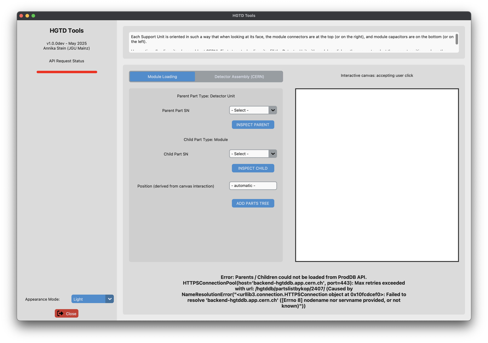
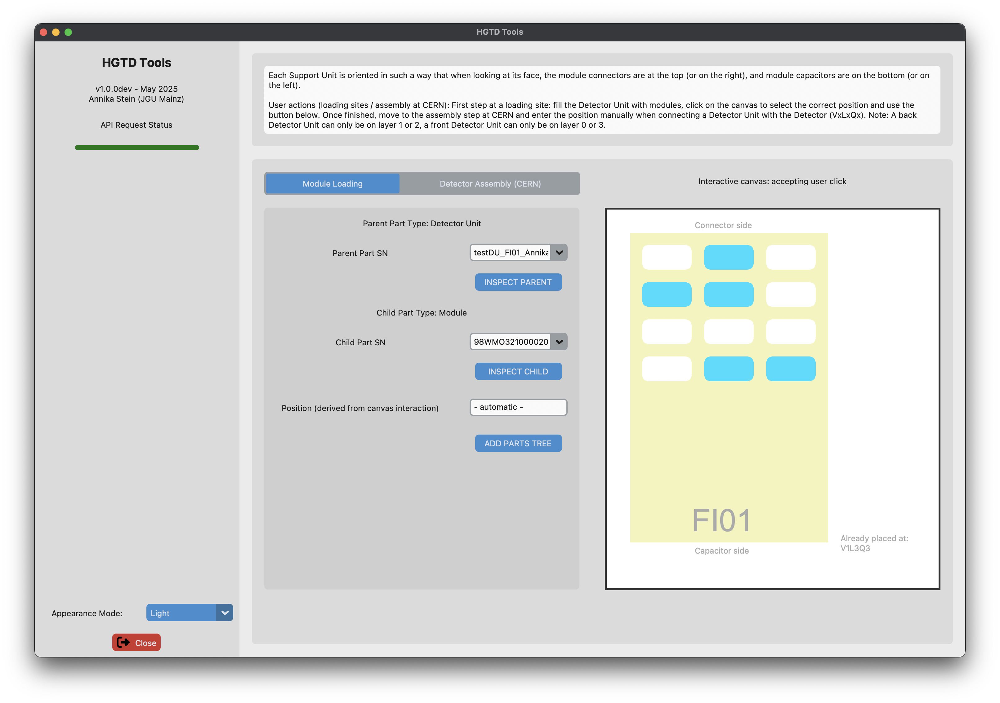
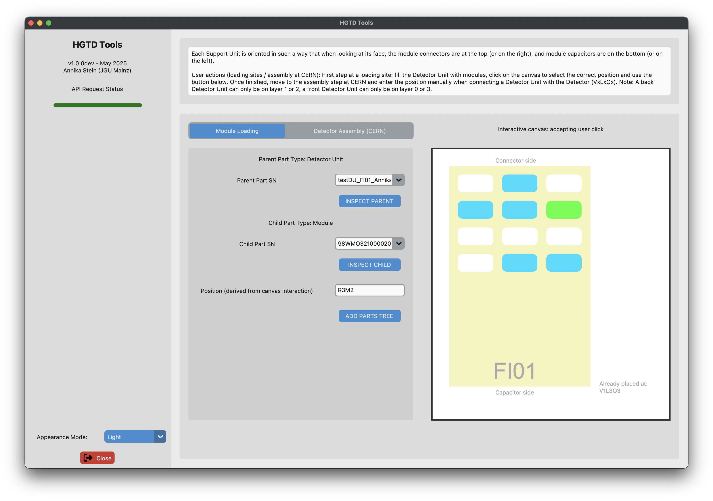
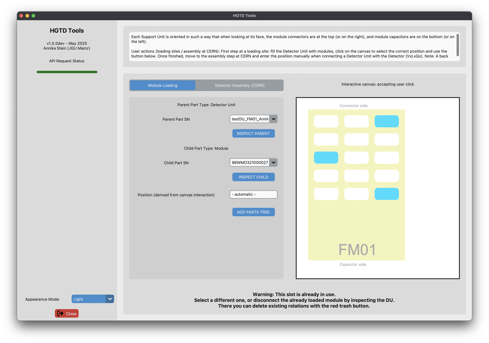
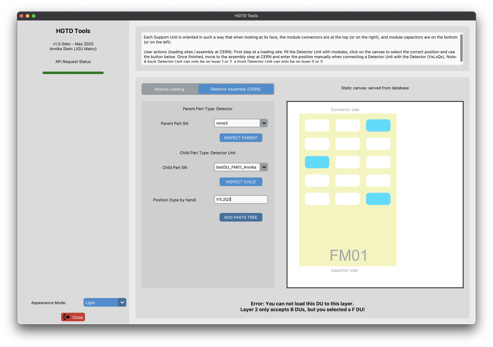
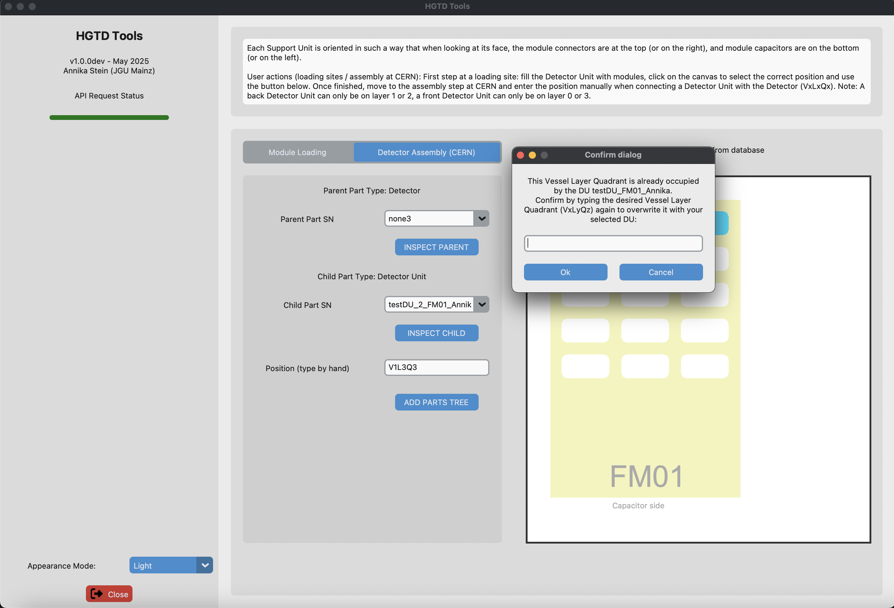

<div align="center">
  <picture>
    <source media="(prefers-color-scheme: dark)" srcset="./windowIcon.png">
    
  </picture>
</div>

<div align="center">

 

</div>

## Description
These tools interact with the HGTD Production Database for the HGTD Phase-II Upgrade of the ATLAS Experiment at CERN.

### Features
- API
- GUI
- Module Loading
- Detector Assembly (CERN)

### Already working
- Selecting and writing parent / child relations with a GUI: canvas to select slots for modules for Module Loading, form data will be processed via "click" position
- Search through partstree and slots to perform multiple POST requests in one go: Detector Assembly (CERN) puts DU on Detector, loaded Modules get Slots
- Uses standard coordinate system for global attributes: Vessel, Layer, Quadrant, DU type / SU type, Row (global), Module (global) and can map to local attributes: Row (on DU), Module (on DU)
- Support for all 48 DU types, including those that have "horizontal" and "vertical" modules on the same unit
- Loaded modules are shown as blue slots when doing Module Loading or Detector Assembly (CERN), desired slots of the user doing Module Loading are highlighted in green
- If DU is already placed in detector, show where it is (Vessel / Layer / Quadrant)
- Catch wrong VLQ entries knowing which combinations are allowed
- Delete request for all existing slots for loaded modules (propagate new VLQ) when new Detector Assembly (CERN) operation is initiated with another VLQ, i.e. effectively replace with new ones
- API request status is updating while thread is running, progressbar fill with different colors
- Any operation that would overwrite the module loading is caught, user first needs to disconnect the module from existing parent DUs or parent Slots or confirm overwriting existing relation(s) in case of detector assembly
- Overwriting existing DU assembly (together with module connections to slots) is possible on the other hand, and propagates the new slots, should automatically delete child relations of affected slots
- Distinction between local lookup files and fetching dynamic tables where needed

### Open points requiring implementation
- (~!!! Replace local files with API-requested files (only few more parts missing, most are already dynamically retrieved)~ first implementation done, being tested (probably a bit slow), second implementation does not need to get full partstree only the children for the specific DU)
- (~!!! Checks for existing slot / mod relations: if they exist, delete them and create the new ones from VLQ~)
    - !!! ~or user decides against that, corrects their entered values~ - kinda implemented already because user sees where the DU is already placed in VLQ
    - !!! ~(and when doing loading as well to catch the case where the same module was previously loaded to a different DU or on that DU in a different location)~ - this module can then not be filled to any slot on the shown DU
    - !!! ~or other case when module shall be loaded into a position that is already occupied by another module~ - user can not add that one because we check for existing children of the DU, and to help visually we display the already used ones)
    - !!! ~catch when VLQ is already occupied by another DU, ask user if they want to disconnect the existing DU (with same DU type) in that VLQ and later on also disconnect any modules from the affected slots~
- (~!! Checks for fully loaded DU (or not yet fully loaded)~)
- (~!! Display loaded modules in canvas when doing Detector Assembly (CERN)~)
- (~!! Catch when Layer is not suitable for front/back side DU type: allowed: Layer 0,3 for Front, Layer 1,2 for Back, also check for allowed vessel, allowed quadrant, nicer textwrap for info message~)
- (~! Button to open /viewparts page to get further info~)
- (~! Button to close application the nice way~)
- (~! Appearance mode selection~)
- (~! Set Color of progressbar while it is loading to orange (showing that the process is not finished yet), let user know somehow that the process is still running~)
- !!! Implement API calls against CERN SSO-protected endpoint (right now only against the "open" backend-hgtddb)
- ! Create standalone application (e.g. use pyinstaller?) -> postponed to v > 1.0.0
- ! Port the hybrid / sensor matching stuff over here and let user decide what kind of tool they want to use at the moment -> postponed to v > 1.0.0

## Showcase of typical use cases
A video showing the main features included with v0.0.1 is available under this [cernbox link](https://cernbox.cern.ch/files/spaces/eos/user/a/anstein/public/for_HGTD/screencast_hgtd-tools_v0p0p1.mov) (protected / atlas-hgtd group access only).

### General aspects
#### API status
HGTD Tools shows a dynamic progress bar whenever one or multiple API requests are ongoing.

<span style="color:green">Green</span>: request was successful (triggered by status codes in the 200s)  
<span style="color:yellow">Yellow</span>: ongoing request, please wait  
<span style="color:red">Red</span>: request resulted in an error that is specified in the status bar in the footer of the application

Example: if you lose connection to the web e.g. by purposefully switching off WiFi for this example, your app will look like this:



#### Appearance mode
Default appearance mode is System default, otherwise feel free to select from Light and Dark mode.

### Module Loading
HGTD Tools shows already loaded module slots on a selected DU. User actions like switching between Loading / Assembly, or selecting different parent or child parts reloads this view freshly with API calls to the database.



When loading a new module to a position on the DU that is not already blocked by another module, this position is highlighted in green. You can proceed with the ADD PARTS TREE button.



Trying to load a module into a position that is already in use is not possible. This requires a further user action to prevent accidentally overwriting something. As noted in the message, feel free to inspect the affected parts clicking the INSPECT ... buttons below the selected serial numbers.



### Detector Assembly (CERN)
HGTD Tools complains if the desired Layer is not compatible with the type of the DU to load there. Other implemented cases catch allowed / not allowed Vessel and Quadrant attributes.



HGTD Tools asks the user for confirmation, if a VesselLayerQuadrant combination was already used for the desired DU type (= already occupied).



## Installation
This suite is written in python, and a conda environment is recommended. The included yaml file also lists a couple of useful packages assisting with further analysing / interpreting the data and was tested to work in April 2025.

### First time usage / requirements:

1. If not already installed, install miniconda, e.g. via `wget https://repo.continuum.io/miniconda/Miniconda3-latest-Linux-x86_64.sh` and then running the .sh script (latest release) with e.g. `bash`. On macOS, the installer is termed slightly differently (`...-MacOSX-x86_64.sh`).
2. Clone the repository, e.g. via `git clone ssh://git@gitlab.cern.ch:7999/anstein/hgtd-tools.git` (here: using ssh key).
3. Depending on how conda was installed, it might require opening a new shell and / or sourcing the `~/.bashrc`.
5. Install the environment using the given yaml file: `cd hgtd-tools; conda env create -f env-312.yml` (you can find it in the main directory).

If you don't like conda (☹️ how? 🤨) or you want to minimize the packages to be installed, make sure to run the tools with a recent python3 environment containing `customtkinter`, `requests`, which can be installed with `pip`. Other used packages of hgtd-tools are already part of the regular python3 lib.

## Usage

To open the main window with GUI, execute the following:

```shell
python main.py
```

## Reusing the included API module
The `api.py` module can be used standalone as well to make API requests to the HGTD Production Database. Note that the included functions also return the response `status_code` and `reason` and handle a variety of possible errors.

The basic types of requests are:

GET: without payload, fetch some specified record/view etc.  
POST: sends a payload (dictionary as json)  
DELETE: without payload, remove some record

Those three variants are implemented as `api.fetch_information`, `api.post_information`, `api.delete_information` handling the endpoint, headers etc. for you so you don't have to worry about anything besides the actual information received, posted or deleted.

## Acknowledgements
Thanks to an unknown reddit user who gave me hope when the PyQt6 installation wouldn't want to work with my setup / machine. This [link](https://www.reddit.com/r/Tkinter/comments/snrb1f/comment/hw4bylf/?utm_source=share&utm_medium=web3x&utm_name=web3xcss&utm_term=1&utm_content=share_button) brought me to [CustomTkinter](https://github.com/TomSchimansky/CustomTkinter) and the GUI is built on top of the tutorial.
