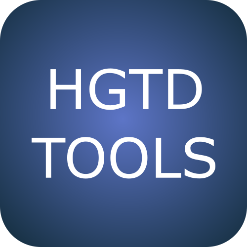
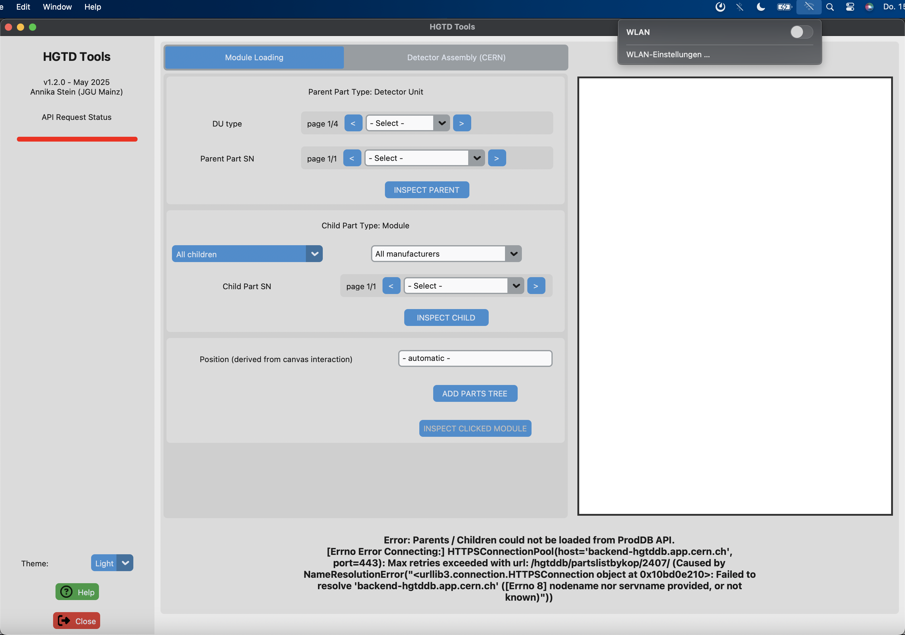
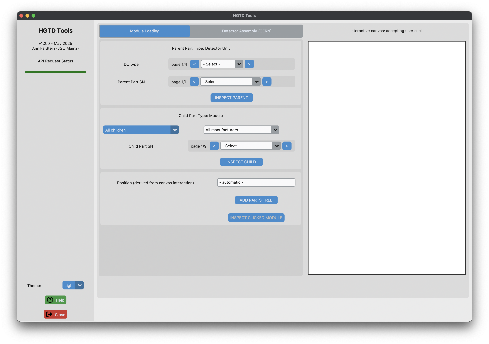
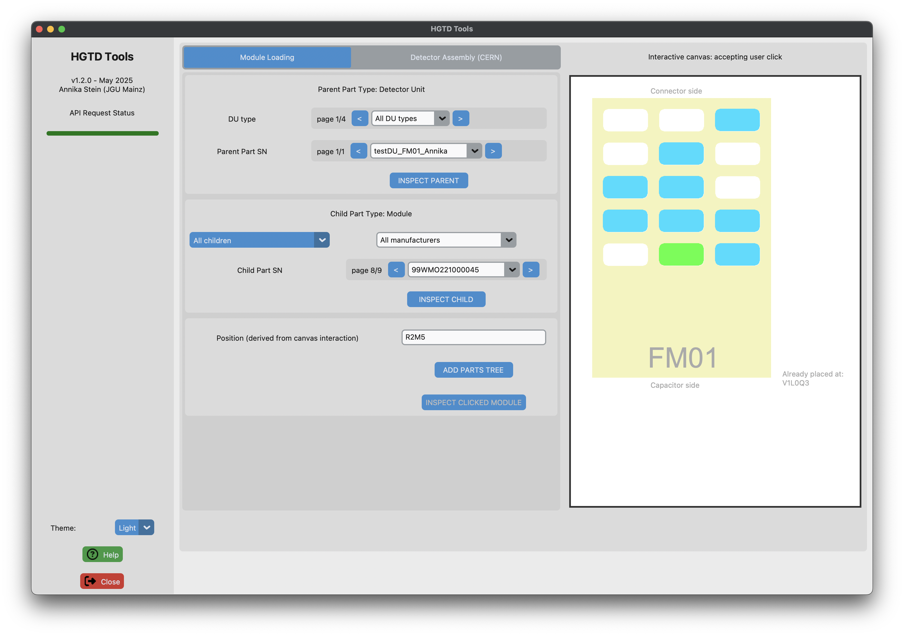
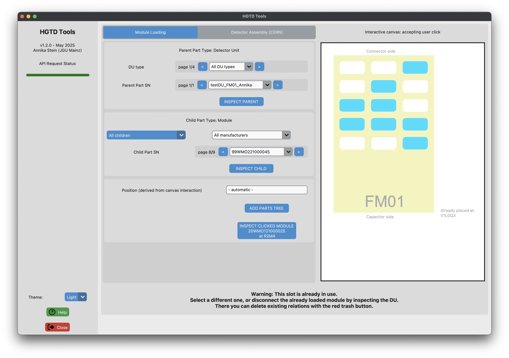
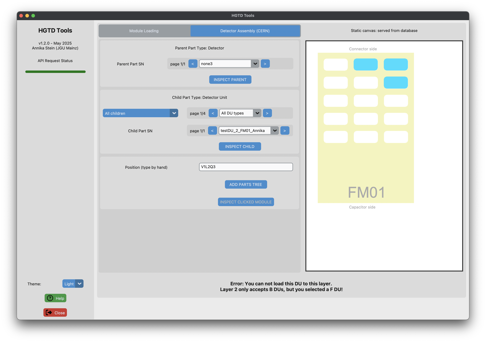
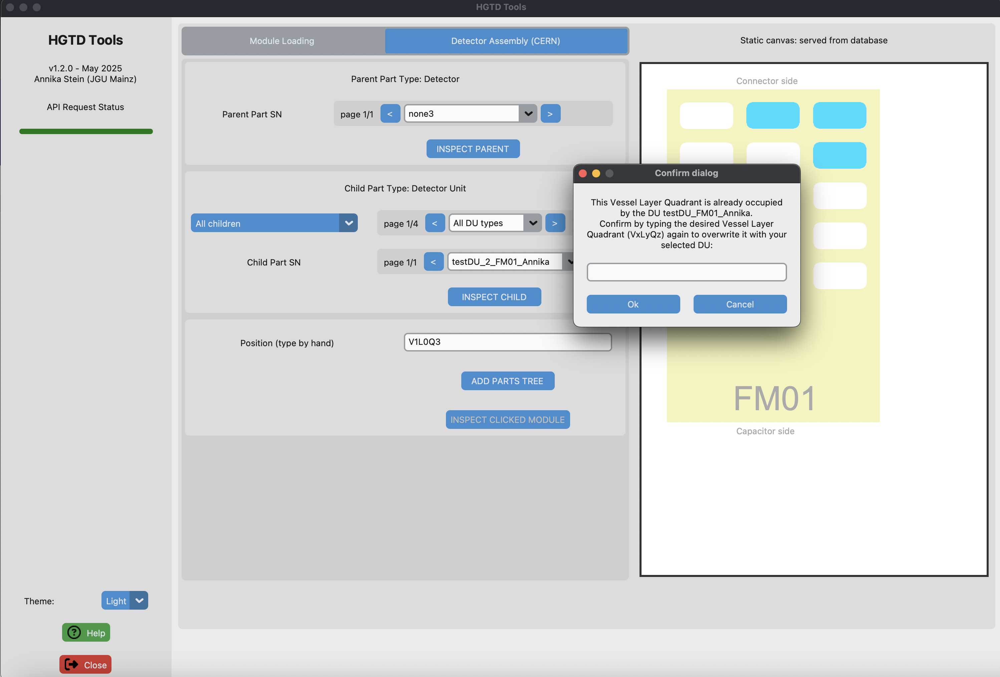

<div align="center">
  <picture>
    <source media="(prefers-color-scheme: dark)" srcset="./windowIcon.png">
    
  </picture>
</div>

<div align="center">

  <br>


</div>

⭐️ You can help with testing and improving the tools for more platforms! ⭐️

## Description
These tools interact with the HGTD Production Database for the HGTD Phase-II Upgrade of the ATLAS Experiment at CERN.

### Features
- API (GET / POST / DELETE)
  - with dynamic progress bar to see API request status
  - efficient lookup of information in local files (e.g. static Slot table) and fetching of dynamic information via ProdDB API
- GUI (Linux / Mac / Windows)
  - clickable canvas to get local coordinates easily, conversion to global coordinates done internally where needed
  - buttons to inspect affected parts
- Modes
  - Module Loading (DU -> MODULE)
  - Detector Assembly (CERN): DU (DETECTOR -> DU & multiple SLOT -> MODULE)
  - Detector Assembly (CERN): PEB (DETECTOR -> PEB)
  - Detector Assembly (CERN): FT (SLOT -> FT; includes global to local coordinate conversion via Slot table)
- Logic
  - new relations can overwrite old ones, if user agrees to do so (implementing replacement of existing relations)
  - user can not load / assemble parts that are not allowed to take that spot (implementing constraints for already used positions, and parts not matching the target position by type)
  - if operation requires subsequent operations (e.g. connecting modules to slots when placing a DU on the detector), perform those subsequent operations in one go
  - query selection before choosing parent / child from full list (e.g. DU type, module manufacturer, child not yet connected or all possible children)

### Open points requiring implementation
New features, bugs, compatibility improvements and other items are collected with the [Issues](https://gitlab.cern.ch/anstein/hgtd-tools/-/issues)

Some of them are also bound to [Milestones](https://gitlab.cern.ch/anstein/hgtd-tools/-/milestones)

## Installation
This suite is written in python, and a conda environment is recommended. The included yaml file also lists a couple of useful packages assisting with further analysing / interpreting the data and was tested to work in April 2025.

### First time usage / requirements:

Linux:
1. (If not already installed): install miniconda, e.g. via `wget https://repo.continuum.io/miniconda/Miniconda3-latest-Linux-x86_64.sh` and then running the .sh script (latest release) with e.g. `bash`.
2. Getting the code: clone the repository, e.g. via `git clone ssh://git@gitlab.cern.ch:7999/anstein/hgtd-tools.git` (here: using ssh key). This is the recommended way to always stay up-to-date. You can also choose to download a specific release version, the [latest release is on the top](https://gitlab.cern.ch/anstein/hgtd-tools/-/releases).
3. Depending on how conda was installed (institute & shell specific), it might require opening a new shell and / or sourcing the `~/.bashrc`.
4. Install the environment using the given yaml file: `cd hgtd-tools; conda env create -f env-312-minimalLinux.yml` (you can find it in the main directory).

MacOS:
1. (If not already installed): install miniconda, e.g. via `wget https://repo.continuum.io/miniconda/Miniconda3-latest-MacOSX-x86_64.sh` and then running the .sh script (latest release) with e.g. `bash`. Full instructions for silent install: https://docs.conda.io/projects/conda/en/stable/user-guide/install/macos.html#installing-in-silent-mode.
2. Getting the code: clone the repository, e.g. via `git clone ssh://git@gitlab.cern.ch:7999/anstein/hgtd-tools.git` (here: using ssh key). This is the recommended way to always stay up-to-date. You can also choose to download a specific release version, the [latest release is on the top](https://gitlab.cern.ch/anstein/hgtd-tools/-/releases).
3. Install the environment using the given yaml file: `cd hgtd-tools; conda env create -f env-312.yml` (you can find it in the main directory).

Windows:
1. (If not already installed): install miniconda: go to https://www.anaconda.com/docs/getting-started/miniconda/install#windows-command-prompt and perform (silent) install of miniconda, via command prompt as described there.
2. Getting the code: if you don't have a git client on your PC, just download and unzip the repository (click the blue Code button -> Download source code -> zip); if you do have a git client, `git clone ssh://git@gitlab.cern.ch:7999/anstein/hgtd-tools.git` (here: using ssh key). This is the recommended way to always stay up-to-date. You can also choose to download a specific release version, the [latest release is on the top](https://gitlab.cern.ch/anstein/hgtd-tools/-/releases).
3. Installing the environment: open Anaconda Prompt, navigate (`cd`) into the dir where you unzipped the repository, `conda env create -f env-312.yml`.


If you don't like conda (☹️ how? 🤨) or you want to minimize the packages to be installed, make sure to run the tools with a recent python3 environment containing `customtkinter`, `requests`, which can be installed with `pip`. Other used packages of hgtd-tools are already part of the regular python3 lib. Only the provided yml files are tested to stay compatible though.

### Updating your local hgtd-tools if this is not your first time installing:

Make sure you get the most recent version, including new features and bugfixes.

If you opted to get hgtd-tools via `git clone` of the repository, you can go ahead by grabbing the changes from here with commands like the following:
```
git switch master
git fetch origin
git pull origin master
```

If you only downloaded a certain version without any git commands, simply download the [latest version](https://gitlab.cern.ch/anstein/hgtd-tools/-/releases) that replaces your local version.

Note: if you had already cloned and installed all dependencies for hgtd-tools and now want to update your conda-environment, you can do
```
conda env update --file env-312.yml  --prune
```
or
```
conda env update --file env-312-minimalLinux.yml  --prune
```
depending on your system.

## Usage

To open the main window with GUI, execute the following from the hgtd-tools directory (using either Anaconda Prompt or your preferred shell with which you installed miniconda):

```shell
conda activate hgtd
python main.py
```

Closing the application works like you would expect from other applications, e.g. you'll find a red button to close hgtd-tools, you could quit the application with shortcuts of your operating system (e.g. MacOS: cmd+Q), or interrupting the python program from command line with ctrl+c.

## Showcase of typical use cases
A video showing the main features included with v0.0.1 is available under this [cernbox link](https://cernbox.cern.ch/files/spaces/eos/user/a/anstein/public/for_HGTD/screencast_hgtd-tools_v0p0p1.mov) (protected / atlas-hgtd group access only).

### General aspects
#### API status
HGTD Tools shows a dynamic progress bar whenever one or multiple API requests are ongoing.

<span style="color:green">Green</span>: request was successful (triggered by status codes in the 200s)  
<span style="color:yellow">Yellow</span>: ongoing request, please wait  
<span style="color:red">Red</span>: request resulted in an error that is specified in the status bar in the footer of the application

Example: if you lose connection to the web e.g. by purposefully switching off WiFi for this example, your app will look like this:



#### Appearance mode (theme)
Default appearance mode is System default, otherwise feel free to select from Light and Dark mode.

### Module Loading
HGTD Tools looks like this when first starting the app. You have various options, comboboxes etc. to preselect the parts to be shown. User actions like switching between Loading / Assembly, or selecting different parent or child parts reloads this view freshly with API calls to the database.



HGTD Tools shows already loaded module slots on a selected DU in blue. User actions like switching between Loading / Assembly, or selecting different parent or child parts reloads this view freshly with API calls to the database.

When loading a new module to a position on the DU that is not already blocked by another module, this position is highlighted in green. You can proceed with the ADD PARTS TREE button.



Trying to load a module into a position that is already in use is not possible. This requires a further user action to prevent accidentally overwriting something. As noted in the message, feel free to inspect the affected parts clicking the INSPECT ... buttons below the selected serial numbers.



### Detector Assembly (CERN)
HGTD Tools complains if the desired Layer is not compatible with the type of the DU to load there. Other implemented cases catch allowed / not allowed Vessel and Quadrant attributes.



HGTD Tools asks the user for confirmation, if a VesselLayerQuadrant combination was already used for the desired DU type (= already occupied).



## Developer corner
### Reusing the included API module
The `api.py` module can be used standalone as well to make API requests to the HGTD Production Database. Note that the included functions also return the response `status_code` and `reason` and handle a variety of possible errors.

The basic types of requests are:

GET: without payload, fetch some specified record/view etc.  
POST: sends a payload (dictionary as json)  
DELETE: without payload, remove some record

Those three variants are implemented as `api.fetch_information`, `api.post_information`, `api.delete_information` handling the endpoint, headers etc. for you so you don't have to worry about anything besides the actual information received, posted or deleted.

### Dockerization
A deployment of this app to CERN OKD using docker is in preparation. 

There are two relevant registry links, for which a login is needed:

first one needs a PAT from gitlab with the right to upload to the registry:
```
docker login gitlab-registry.cern.ch
```
or second one, harbor (see instructions https://atlassoftwaredocs.web.cern.ch/analysis-software/ASWTutorial/softwareEssentials/building_containers/). The secret token can be found from top right click user profile and serves as the password when loggin in:
```
docker login registry.cern.ch
```

The second option is used to deploy to the common registry for the whole hgtddb project.


#### Scripts to build / tag / deploy / run container

Not that all commands involving testing the actual GUI from a remote require an X-server, e.g. start a `ssh -XY` connection from inside XQuartz.

You need Docker installed on your device, e.g. Docker Desktop running in the background.

The `Dockerfile` (or `_lxplus_Dockerfile`) are setup to directly run to the entrypoint that starts the `main.py` with all dependencies already setup.

On Mac: use `bash docker-build_run_on_Mac.sh` if you want to build a new container from the source and run it locally for testing. If you are happy with that, do `bash docker-build_push_for_amd64.sh` to build for the platform that is present at CERN (lxplus, pod -> amd64). You can also run a container on Mac without building a new one, by doing `bash docker-run_on_Mac.sh`.

On linux / lxplus: there is another Dockerfile that pulls the base image from another registry (due to limited number of pulls from the same unauthenticated IP address). You can run a container with an already existing image `bash docker-run_on_lxplus.sh` (see this [source](https://gist.github.com/Moosems/138cfea6fc4e1967e4eae52bd96618ff)) and to build a new image do `bash docker-build_run_on_linux.sh` (does not work yet on lxplus, or you need special rights / uid / gid to perform apt-get install commands).


#### Useful commands to do the build / tag / push / run manually

Build and push a `latest` image to gitlab:
```
docker login gitlab-registry.cern.ch
docker build -t gitlab-registry.cern.ch/anstein/hgtd-tools .
docker push gitlab-registry.cern.ch/anstein/hgtd-tools
```

Use an existing image (see above), tag it with version and push these new ones to harbor:
```
docker login registry.cern.ch

docker tag gitlab-registry.cern.ch/anstein/hgtd-tools registry.cern.ch/hgtd/hgtd-tools:latest
docker tag gitlab-registry.cern.ch/anstein/hgtd-tools registry.cern.ch/hgtd/hgtd-tools:1.4.2

docker push registry.cern.ch/hgtd/hgtd-tools:latest
docker push registry.cern.ch/hgtd/hgtd-tools:1.4.2

docker image tag registry.cern.ch/hgtd/hgtd-tools:x86_64_1.4.2 registry.cern.ch/hgtd/hgtd-tools:latest
docker push registry.cern.ch/hgtd/hgtd-tools:latest
docker push registry.cern.ch/hgtd/hgtd-tools:x86_64_1.4.2

```

## Acknowledgements
Thanks to an unknown reddit user who gave me hope when the PyQt6 installation wouldn't want to work with my setup / machine. This [link](https://www.reddit.com/r/Tkinter/comments/snrb1f/comment/hw4bylf/?utm_source=share&utm_medium=web3x&utm_name=web3xcss&utm_term=1&utm_content=share_button) brought me to [CustomTkinter](https://github.com/TomSchimansky/CustomTkinter) and the GUI is built on top of the tutorial.
