# Main GUI to work on part-to-part relations

> Add, modify and delete relations within the Parts Tree with hgtd-tools

[hgtd-tools](https://gitlab.cern.ch/anstein/hgtd-tools){target="_blank"} is a
software that assists you in adding, modifying or deleting relations between
parts with a graphical user interface (GUI).

Besides the "Add Parts Tree" and "Bulk Parts Tree" pages of the main frontend,
hgtd-tools allows you to select locations within a Detector Unit (DU) by
clicking, has implemented logic to prevent accidentally filling parts into
locations where they are not allowed, or where there already is a connected
part, and directly interfaces the Slot table to map global with local positions.

Each of the five currently implemented operation modes comes with its own form /
user input mask that allows you to preselect only specific parts matching some
criteria like type, manufacturer, location, connection status (already connected to a
part of a certain kind, or not yet connected). Some modes only affect relations
directly written by the user, while others perform automatic behind-the-scenes
operations with relations to other KoPs (most importantly: Slot table).

??? tip "What even is a slot?"

    A slot is a combination of a vessel, layer, quadrant and one of the following combinations: a global row and module number, or a DU type along with local row and module number.

    Hence, you can specify a module location in the detector and map it back to where this module is loaded within its DU, or vice-versa.

    Serial numbers of slots are of the following scheme: `Va:Lb:Qc:Rd:Me`, with `a,b,c,d,e` placeholders for the global coordinates.

    Learn more about the slot table in [this presentation](https://indico.cern.ch/event/1479316/#342-qt-report-hgtd-production){target="_blank"}.

The operation modes of hgtd-tools and what relations are affected:

| Mode      | Parent KoP        | Child KoP                  | Position|
| ----------- | ----------- | ------------------------- | ----- |
|  |  |  |  |
| Module Assembly | Module | Module Flex | empty |
| Module Assembly | Module | Hybrid | one of either `HV` or `LV` |
|  |  |  |  |
| Module Loading | Detector Unit       | Module  | local coordinates of form `RxMy` |
|  |  |  |  |
| Detector Assembly (CERN): DU | Detector       | Detector Unit  | global coordinates of form `VxLyQz` |
| Detector Assembly (CERN): DU | Slot       | Module  | empty |
|  |  |  |  |
| Detector Assembly (CERN): PEB | Detector       | PEB  | global coordinates of form `VxLyQz` |
|  |  |  |  |
| Detector Assembly (CERN): FT | Slot       | Flex Tail  | empty |
| Detector Assembly (CERN): FT | Module       | Flex Tail  | empty |
| Detector Assembly (CERN): FT | Detector Unit       | Flex Tail  | local coordinates of form `RxMy` |
| Detector Assembly (CERN): FT | PEB       | Flex Tail  | local coordinates of form `RxMy` |

If you do not find the relation you wish to enter in this table, refer to the [alternative strategy with the main frontend single or bulk upload](https://hgtd-database.docs.cern.ch/content/user/fill_parts_tree/){target="_blank"} instead.

!!! success "Get ready to use hgtd-tools"
    Please follow the [install guide](../getting_started/install.md) to learn more about how you can install hgtd-tools on your machine and read the [quickstart instructions](../index.md#quickstart). This should take no more than one hour when starting the installation from scratch, including first ever install of miniconda3 as a package manager for python3 if you had never done so on your machine.

    Once you are done with installation (and have activated your environment, e.g. with `conda activate hgtd` as in the instructions), start the GUI:

    ```shell
    python main.py
    ```

## User Manual
At startup, the GUI looks like the following:
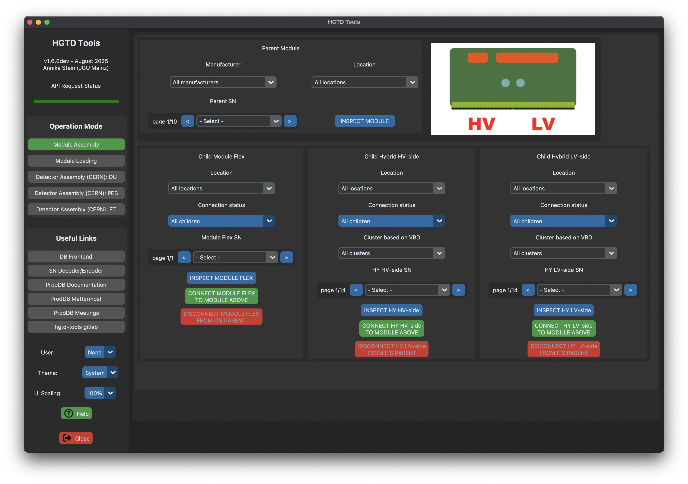
You can select the operation mode from the left sidebar, while the main frame
contains the actual user input and buttons to perform the parts tree operations.

!!! warning "User login"
    **Why login?**
    When starting the software, please login using your CERN account. This will
    be used to relate your new additions in the database to your username. In
    case there are questions to those records, we will know whom to contact!
    Since version v1.7.2 and later, user login is mandatory for operations
    that add or delete relations. Just fetching data is still possible without login.

    Without login and attempting to perform POST/DELETE DB operations, e.g. adding relations, the GUI will error and abort the operation:
    

    **How to login to hgtd-tools:**
    When you click on the User dropdown menu (which originally says "None"),
    select "new...". This will open a new window where you can type in your
    username, password (and if setup, TOTP code for 2FA). After your login was successful,
    the blue box will list your username, and otherwise fallback. In hgtd-tools, the login is valid for the entire runtime of the program; in cli scripts interfacing against the API with user-tokens, login is valid for one workday (8hrs).

!!! note "General aspects and settings"
    **API status**

    HGTD Tools shows a dynamic progress bar whenever one or multiple API requests are ongoing. A request can be anything from getting data, uploading data, or deleting data.

    <span style="color:green">Green</span>: request was successful (triggered by status codes in the 200s)  
    <span style="color:yellow">Yellow</span>: ongoing request, please wait  
    <span style="color:red">Red</span>: request resulted in an error that is specified in the status bar in the footer of the application

    Example: if you lose connection to the web e.g. by purposefully switching off WiFi for this example, your app will look like this:

    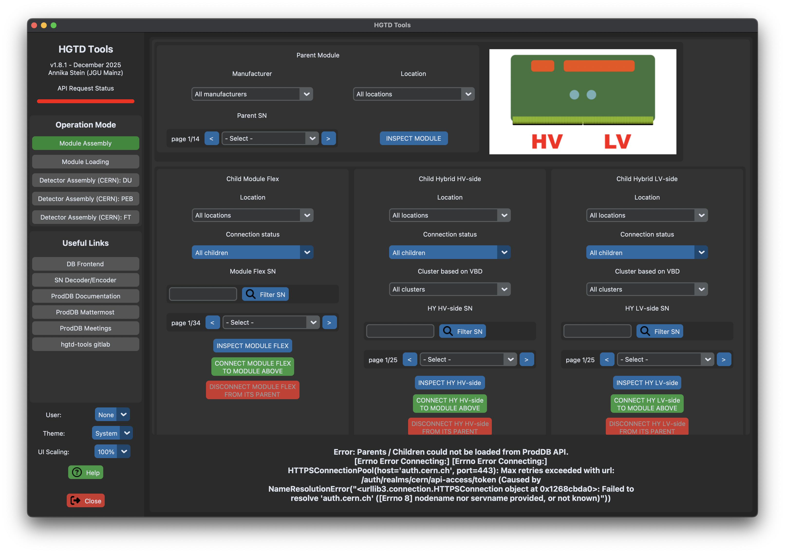

    Should you get any API errors mentioning something like `Internal Server Error`, or something that is clearly not related to your own connection to the web, please inform the ProdDB team. A link to the mattermost is available on the hgtd-tools GUI sidebar.

    **Useful links**

    The sidebar lists various links to related websites.

    **Appearance Mode (Theme)**

    Default appearance mode is System default, otherwise feel free to select from Light and Dark mode.

    **UI Scaling (Zoom)**

    Default scaling is 100%, you can scale the content to your liking.

    **Navigation of paginated comboboxes**

    Because some operating systems tend to not display long lists of serial numbers correctly, we opted to placing such long lists into pages with fixed maximum length per page. You will see that for example the number of available modules in the database are too many to show on one screen, and so you get left / right buttons to navigate through pages of serial numbers.

    **Selections**

    Parts can be selected based on features such as manufacturer, location, type, serial number or connection status. Connection status refers to parents or children connections, for child and parent components, respectively.

    :warning: Use "Connection status" only after preselecting from other dropdowns/inputs, to limit the number of parts to process against the DB parts tree.

### Operation Modes

??? info "Module Assembly"

    **Affected relations**

    Module Assembly with hgtd-tools implements the following relations:

    - Module to Module Flex
    - Module to Hybrid (2x, once for HV-side, once for LV-side)

    Besides the relations selected by the user, no other relations are affected.

    **Initial view**

    At startup, the GUI looks like the following:
    

    **Implemented functionality**

    - Selection of parts that fulfil the criteria you placed on manufacturer, location, serial number, connection status for the parent (Module); on location, serial number, connection status of child (Module Flex); on location, serial number, connection status, and WIP on cluster of children (Hybrids).
    - You can inspect the parent.
    - You can inspect, connect, disconnect children.
    - hgtd-tools does not let you connect parts for positions that are already taken by other parts, unless you actively instruct hgtd-tools to OVERWRITE the existing relation(s).
    - hgtd-tools inspects existing relations and reports on their consistency and validity with respect to DB conventions.

    **:construction: Work-in-progress functionality**

    - Selection and matching of hybrids (according to certain clusters that have similar values for observables related to (sensor) VBD etc.) from dropdown menu. See [this issue](https://gitlab.cern.ch/anstein/hgtd-tools/-/issues/11){target="_blank"} to learn more.

??? info "Module Loading"

    **Affected relations**

    Module Loading with hgtd-tools implements the following relations:

    - Detector Unit to Module (as taken from user input by clicking on the respective slots)

    Besides the relations selected by the user, no other relations are affected.

    **Initial view**

    At startup, the GUI looks like the following:
    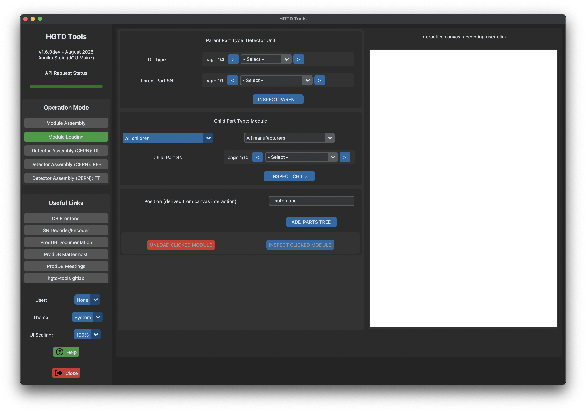

    **Implemented functionality**

    - Selection of parts that fulfil the criteria you placed on type for the parent (Detector Unit); on manufacturer, serial number, connection status of child (Module).
    - You can inspect the parent.
    - You can inspect, connect, disconnect children.
    - hgtd-tools shows a graphical view of the DU type along with its color-coded module slots, if the serial number contains one of the [48 allowed DU types](https://gitlab.cern.ch/anstein/hgtd-tools/-/blob/master/data.py?ref_type=heads#L119){target="_blank"}.
    - hgtd-tools does not let you connect modules for positions that are already taken by other modules. You can not simply overwrite, you perform "unloading" manually (red button), and then you can take this spot and load a module to it again.

    **:construction: Work-in-progress functionality**

    None at the moment.

    **Further screenshots and explanations**

    HGTD Tools shows already loaded module slots on a selected DU in blue. User actions like switching between Loading / Assembly, or selecting different parent or child parts reloads this view freshly with API calls to the database.

    When loading a new module to a position on the DU that is not already blocked by another module, this position is highlighted in green. You can proceed with the ADD PARTS TREE button. If loading was successful, the interface will show a refreshed DU image with one more blue slot.

    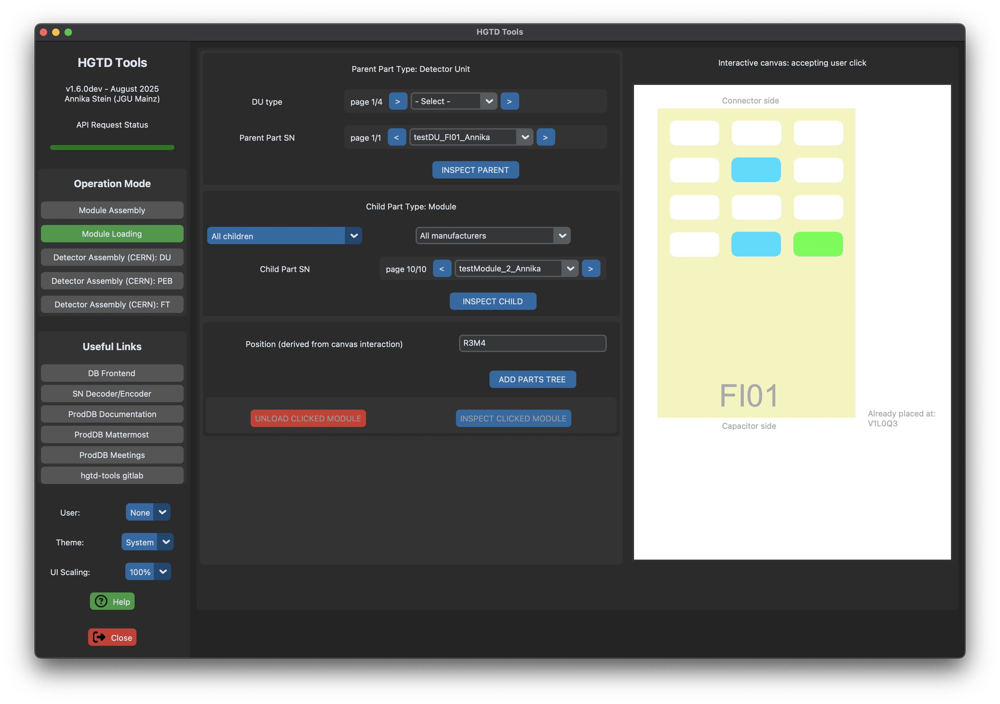

    Trying to load a module into a position that is already in use is not possible. This requires a further user action to prevent accidentally overwriting something. As noted in the message, feel free to inspect the affected parts clicking the INSPECT ... buttons below the selected serial numbers. You can also disconnect the already loaded module right from the hgtd-tools interface with the red button.

    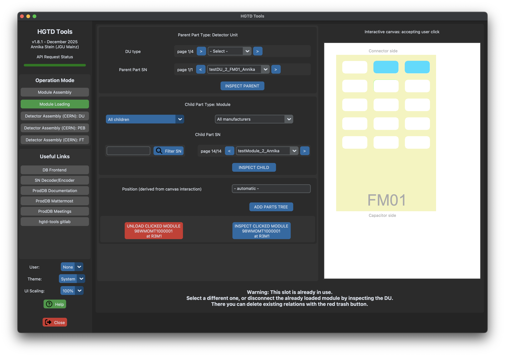

??? info "Detector Assembly (CERN): DU"

    **Affected relations**

    Detector Assembly (CERN): DU with hgtd-tools implements the following relations:

    - Detector to Detector Unit (as taken from user input by inserting the desired VesselLayerQuadrant)

    Besides the relations selected by the user, the following relations are affected:

    - Slot to Module (derived from children of the affected DU, using the Slot table)

    :warning: If you are indeed loading parts for the real detector, pick `Detector_Assembly_CERN` as your detector parent. Other "detectors" are just for testing.

    **Initial view**

    At startup, the GUI looks like the following:
    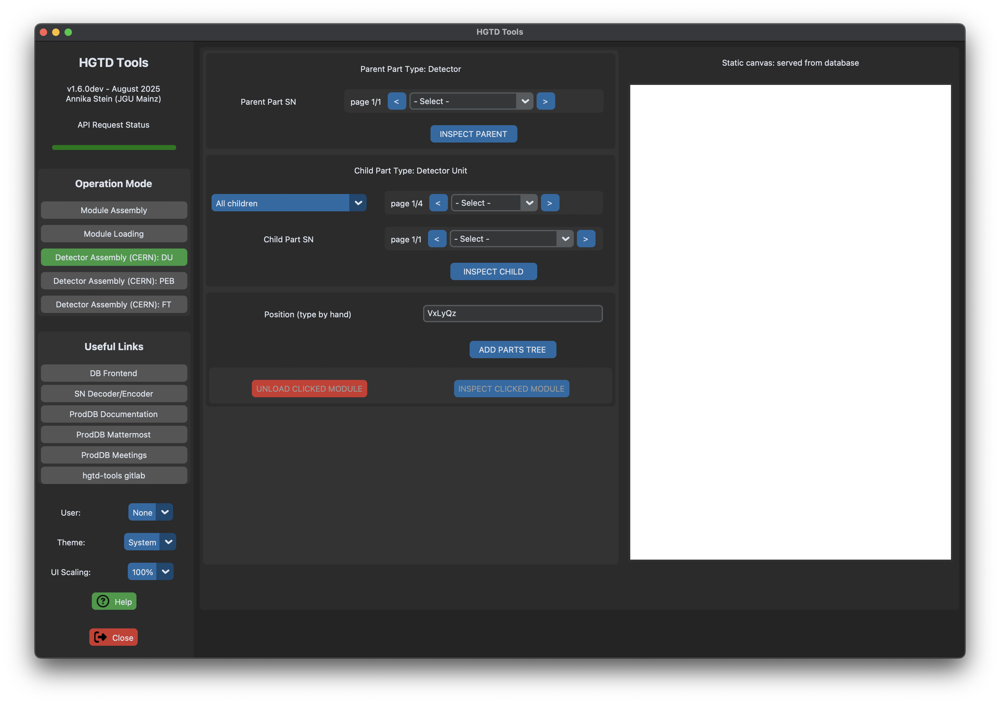

    **Implemented functionality**

    - Selection of parts that fulfil the criteria you placed on type, serial number, connection status for the child (Detector Unit).
    - You can inspect the parent.
    - You can inspect, connect the child. You can overwrite the child DU at a certain VesselLayerQuadrant.
    - You can inspect, disconnect modules on the selected child DU.
    - hgtd-tools does not let you connect DUs for positions that are already taken by other DUs, but you can OVERWRITE with another DU of the same type.

    **:construction: Work-in-progress functionality**

    None at the moment.

    **Further screenshots and explanations**

    HGTD Tools complains if the desired Layer is not compatible with the type of the DU to load there. Other implemented cases catch allowed / not allowed Vessel and Quadrant attributes.

    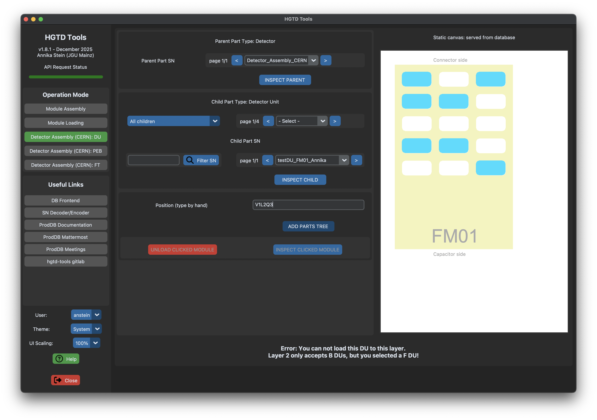

    HGTD Tools asks the user for confirmation, if a VesselLayerQuadrant combination was already used for the desired DU type (= already occupied).

    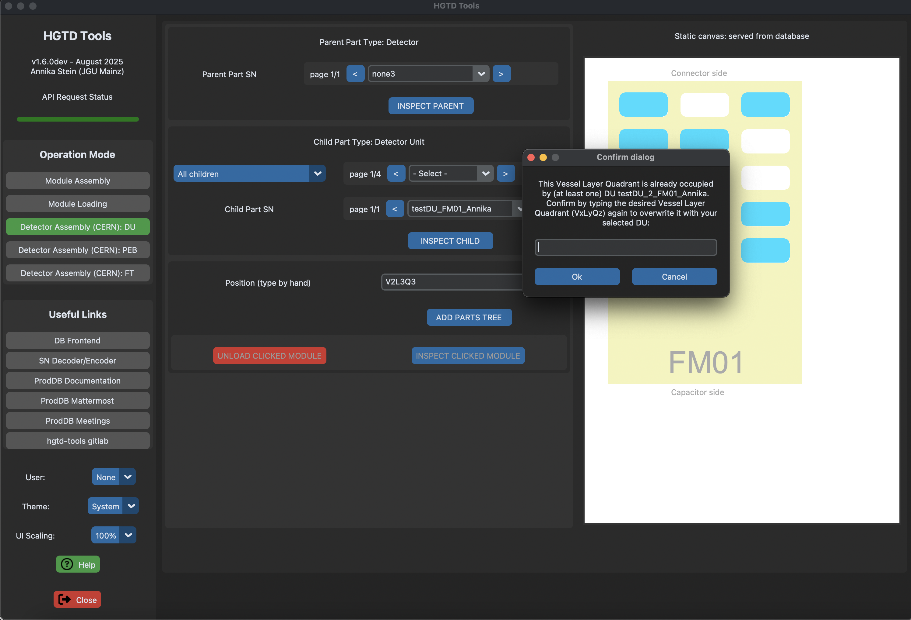

??? info "Detector Assembly (CERN): PEB"

    **Affected relations**

    Detector Assembly (CERN): PEB with hgtd-tools implements the following relations:

    - Detector to PEB (as taken from user input by inserting the desired VesselLayerQuadrant)

    Besides the relations selected by the user, no other relations are affected.

    :warning: If you are indeed loading parts for the real detector, pick `Detector_Assembly_CERN` as your detector parent. Other "detectors" are just for testing.

    **Initial view**

    At startup, the GUI looks like the following:
    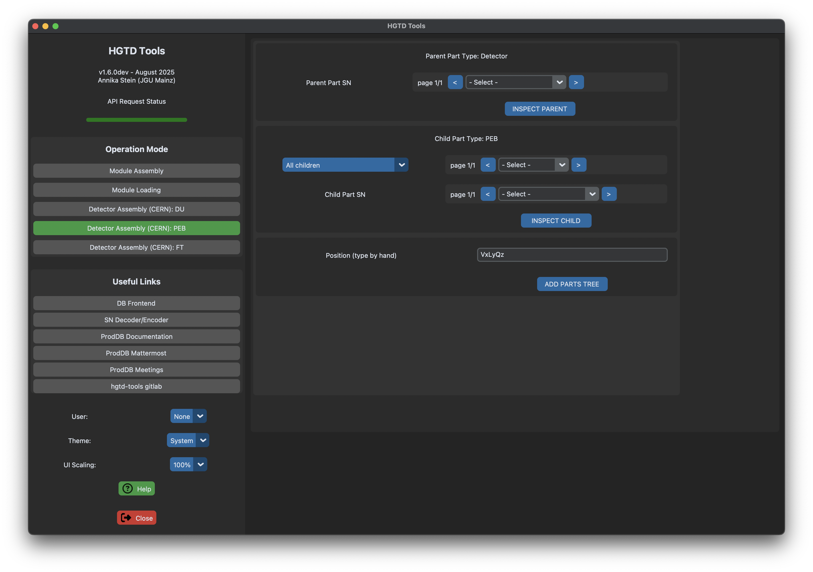

    **Implemented functionality**

    - Selection of parts that fulfil the criteria you placed on type, serial number, connection status for the child (PEB).
    - You can inspect the parent.
    - You can inspect, connect the child. You can overwrite the child PEB at a certain VesselLayerQuadrant.
    - hgtd-tools does not let you connect PEBs for positions that are already taken by other PEBs, but you can OVERWRITE with another PEB of the same type.

    **:construction: Work-in-progress functionality**

    None at the moment.

    **Further explanations**

    HGTD Tools complains if the desired Layer is not compatible with the type of the PEB to load there. Other implemented cases catch allowed / not allowed Vessel and Quadrant attributes.

    HGTD Tools asks the user for confirmation, if a VesselLayerQuadrant combination was already used for the desired PEB type (= already occupied), similar to the DU check.

??? info "Detector Assembly (CERN): Flex Tails"

    **Affected relations**

    Detector Assembly (CERN): Flex Tails with hgtd-tools implements the following relations:

    - Slot to Flex Tail (after selection of slot by the user and picking a flex tail with matching length (category) of a certain FT generation)

    Besides the relations selected by the user, the following relations are affected:

    - Module to Flex Tail (derived from Slot)
    - DU to Flex Tail (derived from Module)
    - PEB to Flex Tail (derived from Slot table)

    Disconnecting a flex tail means removing all its parents, i.e. four relations affected.

    **Initial view**

    At startup, the GUI looks like the following:
    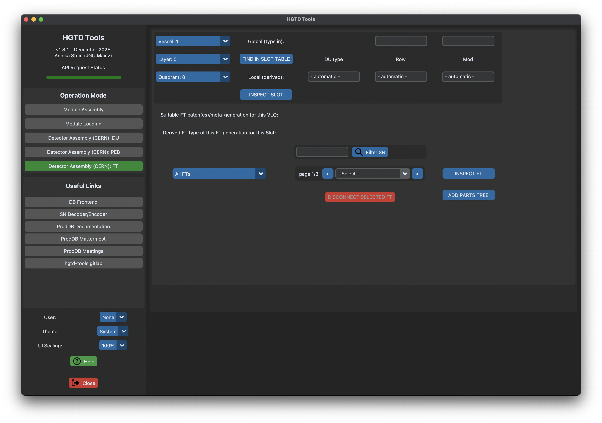

    **Implemented functionality**

    - Selection of the parent Slot with its global labeling scheme, retrieve the corresponding local labeling to assist you ("FIND IN SLOT TABLE" button).
    - Selection of parts that fulfil the criteria you placed on serial number, connection status for the child (FT).
    - You can inspect the parent.
    - You can inspect, connect, disconnect the child.
    - hgtd-tools does not let you connect FTs for positions that are already taken by other FTs, but you can OVERWRITE with another FT of the same category.

    **:construction: Work-in-progress functionality**

    None at the moment.

    **Further screenshots and explanations**

    HGTD Tools complains if the desired combination of Vessel, Layer, Quadrant, Row and Module does not exist.

    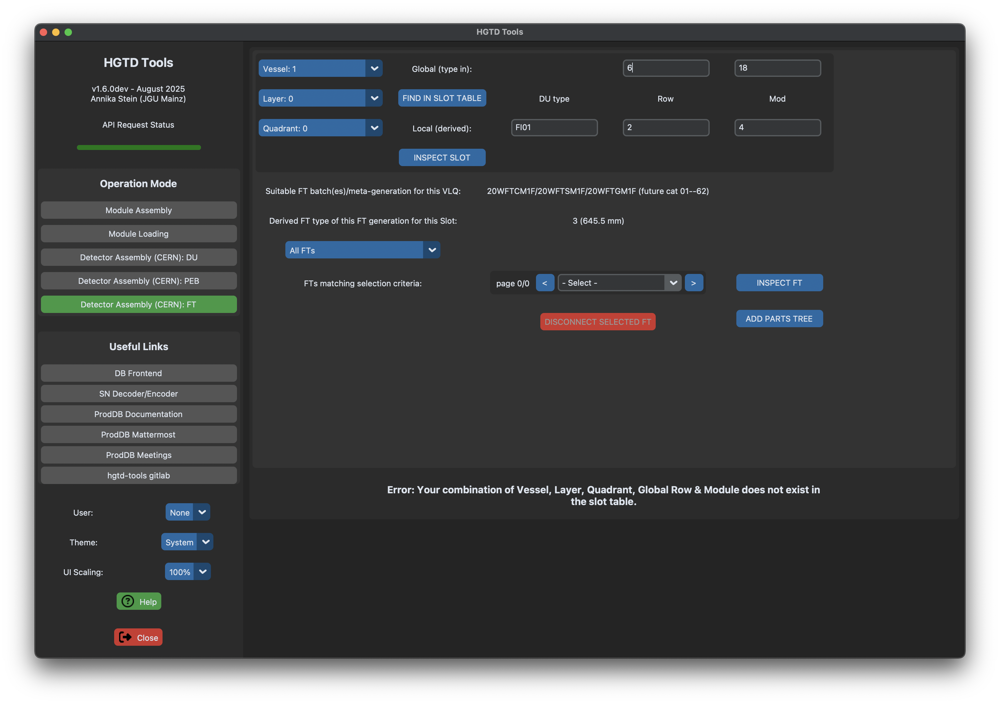

    HGTD Tools asks the user for confirmation, if another FT was already used for the desired Slot, similar to the DU check.

## Standard workflows

??? question "Finding local position (in DU) at a given global position"

    ??? example "Manually in csv table"

        This only knows about the theory, if you just need the translation between labeling schemes.

        1. Open [slot table](https://gitlab.cern.ch/anstein/slotsflextailspreproduction/-/blob/master/SlotTable/all_slots_withOutdatedPlaceholder.csv?ref_type=heads){target="_blank"}. (You may want to download a local copy and periodically check for updates, although now with all CAD drawings and corresponding FT categories, no fundamental changes are expected).
        2. Search for slot to cross-check its local position, slot serial numbers use global scheme, i.e.  
            which vessel? D, M, 1, 2  
            which layer? 0,...,3  
            which quadrant? 0,...,3  
            which row?  
            which module?
        3. Look for columns: `SU_Row` and `SU_Module`, these are the local positions you are looking for.

    ??? example "With hgtd-tools GUI open"

        1. Go to Operation Mode "Detector Assembly (CERN): FT". (Because this is usually needed when connecting flex tails).
        2. Search for slot in question, slot serial numbers use global scheme, i.e.  
            From blue dropdown: which vessel? D, M, 1, 2  
            From blue dropdown: which layer? 0,...,3  
            From blue dropdown: which quadrant? 0,...,3  
            From upper input box: which row?  
            From upper input box: which module?
        4. Hit the "FIND IN SLOT TABLE" button. Local positions are retrieved from slot table.

??? question "Finding which module is connected at a given global position"

    ??? example "With hgtd-tools GUI open"

        1. Go to Operation Mode "Detector Assembly (CERN): FT". (Because this is usually needed when connecting flex tails).
        2. Search for slot in question, slot serial numbers use global scheme, i.e.  
            From blue dropdown: which vessel? D, M, 1, 2  
            From blue dropdown: which layer? 0,...,3  
            From blue dropdown: which quadrant? 0,...,3  
            From upper input box: which row?  
            From upper input box: which module?
        3. Hit the "FIND IN SLOT TABLE" button.
        4. Hit the "INSPECT SLOT" button. Its parts detail page will open in your webbrowser.
        5. Check part children. If both required operations - module loading, DU assembly - have been carried out correctly with hgtd-tools, you will find your module there.

## Common issues / solutions

??? question "UI elements are cut off (screen resolution issue)"

    If you use a screen resolution that can not display the whole UI, scale the text to a smaller size with the dropdown button on the lower left. The easiest way to check if this should be done is to cross-check if you can see all the buttons from Module Assembly, all the way down to the red delete buttons (see example screenshots above). If your UI is already cut off above, scale the text to your needs.

??? question "Not authorized issue"

    Have you followed the steps from the [install guide](../getting_started/install.md) fully, for example, did you also download the `config_api` file into the main directory of `hgtd-tools`? This is likely missing if you are not authorized to perform operations despite trying with login. This file is only accessible to proddb-users (you need to join the e-group first). For the latter, you can follow the steps [here](https://hgtd-database.docs.cern.ch/content/user/user_tasks/){target="_blank"}.

??? question "Parts take too long to load after selecting based on connection status"

    This happens if your preselection of parts was not tight enough -- the connection status is an expensive DB query carried out for all parts surviving your preselection via menus/fields such as manufacturer, location, type, or serial number. Restrict the list of parts for which this expensive operation is done by the other "cuts" and observe how the process will significantly speed up. If an ongoing selection is taking too long to complete (yellow progress bar continuously running...), then you can of course close the app and restart fresh with a stricter preselection before running the connection query.

## Demonstrator extras

At the demonstrator, many steps should have been done by assembly or loading sites already, but weren't at that time. That is why you might need to look up specifically which module has which serial number in the DB when you want to fill the demonstrator parts tree into the DB. We have a separate page for hints on the [Parts List](https://hgtd-database.docs.cern.ch/content/user/view_part_list/){target="_blank"}.

## Developer extras and connection to FADAPro

The API client of hgtd-tools also runs standalone, hence it can be used together with e.g. FADAPro to upload module measurements to the database. Learn more about it in the [developer section](../development/dev.md). The implementation for FADAPro is part of the analysis module and contains a new script called `DB_interface.py`. See the corresponding changes [here](https://gitlab.cern.ch/atlas-hgtd/Electronics/fadapro/-/tree/master/analysis?ref_type=heads){target="_blank"}.
